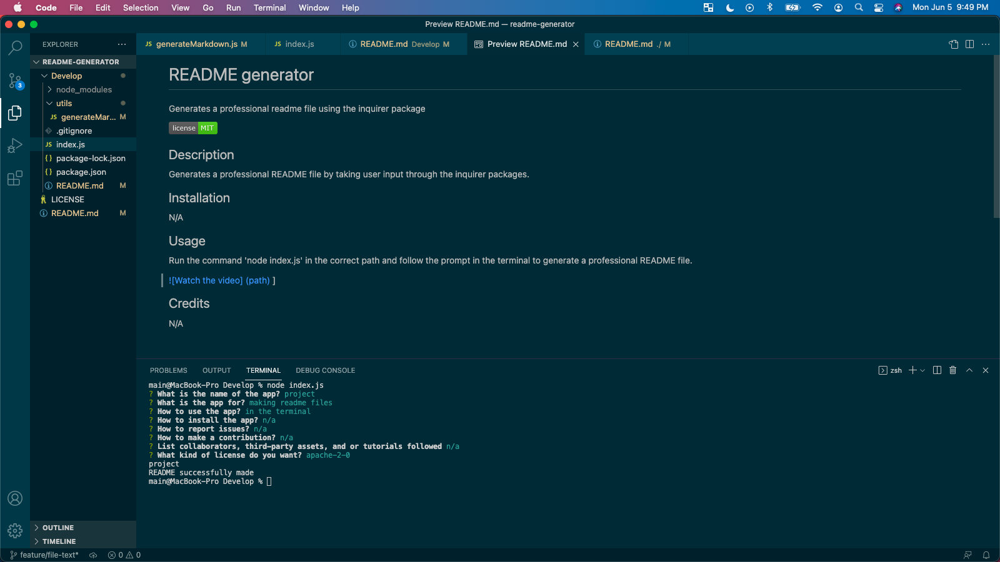

# README generator

    

## Description
Generates a professional README file by taking user input through the inquirer packages.

## Installation
N/A

## Usage
Run the command 'node index.js' in the correct path and follow the prompt in the terminal to generate a professional README file.

 

## Credits
N/A

